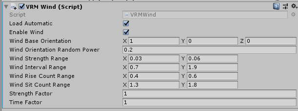

# WindForVRM

* 獏星(ばくすたー)
* 2019/11/09

Sample repository to introduce wind effect for VRM.

VRMの揺れもの(`VRMSpringBone`)に風っぽいエフェクトを入れるための作例です。

## 手元の検証環境

以下の組み合わせで動作確認しています。

* Unity 2018.3.7f1
* UniVRM v0.53.0
* ニコニ立体ちゃん(Alicia)

## 導入手順

* 手元のプロジェクトに、[UniVRM](https://github.com/vrm-c/UniVRM)のReleasesからパッケージを導入します。
* このレポジトリのReleasesからUnityPackageをダウンロードしてインポートします。
    - UnityPackageの内容は、このレポジトリの`WindForVrm/Assets/WindForVrm/`以下と同じです。
* あらかじめシーン上にロードしたVRMや、`prefab`化されたVRMに風エフェクトを適用する場合、`VRMWind`コンポーネントをVRMに割り当てます。
* 動的にVRMをロードする場合、シーンの他の場所に`VRMWind`コンポーネントがアタッチされたオブジェクトを配置しておいて、VRMのロード時点で`LoadVrm(Transform vrmRoot)`を呼び出します。

## パラメータについて

基本設定

* Load Automatic: VRMに直接このコンポーネントをアタッチしているとき、チェックをオンにしておくと、スタート時に風の計算が始まります。
* Enable Wind: オンになっている間、風が有効です。
* Wind Base Orientation: 風向きです。ワールド座標で指定します。

ランダム化のためのパラメータ

* Wind Strength Range: 風を強めたり弱めたりする、ランダムな幅の最小値と最大値です。
* Wind Interval Range: 風の生成間隔(秒)のランダムな長さの、最小値と最大値です。
* Wind Rise Count Range: 風がはじめ強くなる立ち上がり時間(秒)の最小値と最大値です。
* Wind Sit Count Range: 風が強くなりきったあと、徐々に弱くなっていく時間(秒)の最小値と最大値です。

ファクター

* Strength Factor: この値を引き上げると、全体的に風が強くなります。
* Time Factor: この値を大きくすると、風が断続的に来ているような動きになります。逆に、値を小さくすると、風が細かく吹いているような動きになります。
